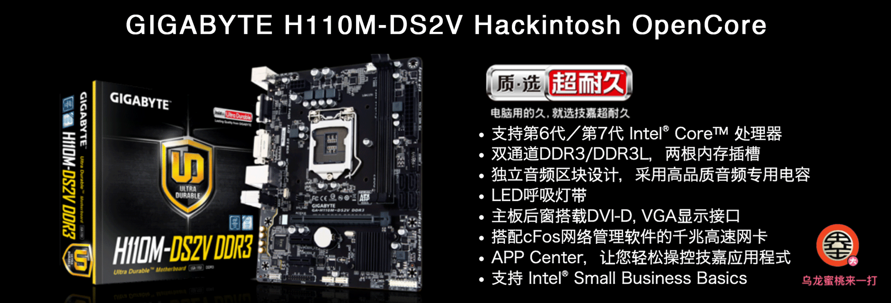

## 技嘉 H110M-DS2V 黑苹果 OpenCore EFI



### [ENGLISH](README.EN.md)

### OpenCore

[OpenCore 0.9.5](https://github.com/acidanthera/OpenCorePkg)

### macOS

- macOS Monterey 12.x
- macOS Ventura  13.x

### 硬件

- 芯片组: H110
- Bios 版本: F21 06/09/2017
- 处理器: 英特尔7代 i3-7100
- 内   存: 金士顿 8GB DDR4 2400Mhz
- 硬   盘: 金士顿 SATA SSD 120G Windows
- 硬   盘: 金士顿 SATA SSD 240G MacOS
- 核   显: 英特尔核心显卡630 （VGA & DVI output）
- 声   卡: 瑞昱 ALC887
- 有线网卡:  瑞昱 RTL8168/8111
- 无线网卡: 无

### BIOS设置

```
BIOS
     |-- Fast Boot：Disabled
     |-- Windows 8/10 Fetures：Other OS
     |-- CSM Support：Disabled
     |-- Storage Boot Option Control：UEFI
     |-- Other PCI devices：UEFI

Peripherals
	   |-- USB Configuration
	      |-- Leacy USB Support：Enabled
	      |-- XHCI Hand-off：Enabled
	   |-- SATA And RST Configuration
	      |-- SATA Mode Selection：AHCI
Chipset		
     |-- VT-d：Disabled
     |-- Internal Graphics：Enabled
     |-- DVMT Pre-Allocated：64M
     |-- DVMT Total Gfx Mem：MAX
     |-- IOAPIC 24-2119 Entries：Disabled
```

### 注意事项

 - 安装成功后必须使用 [OpenCore Configurator](https://mackie100projects.altervista.org/opencore-configurator/) 或者 [OCAuxiliaryTools](https://github.com/ic005k/OCAuxiliaryTools) 生成你自己的 SMBIOS


### 联系我们

QQ群: 23304408


### 常用工具

- [Hackintool](https://github.com/headkaze/Hackintool) 
- [OCAuxiliaryTools](https://github.com/ic005k/OCAuxiliaryTools) AKA `OCAT`.
- [OpenCore Configurator](https://mackie100projects.altervista.org/opencore-configurator/) AKA `OCC`.
- [gibMacOS](https://github.com/corpnewt/gibMacOS) Build your own MacOS image.
- [ProperTree](https://github.com/corpnewt/ProperTree) Plist editor.